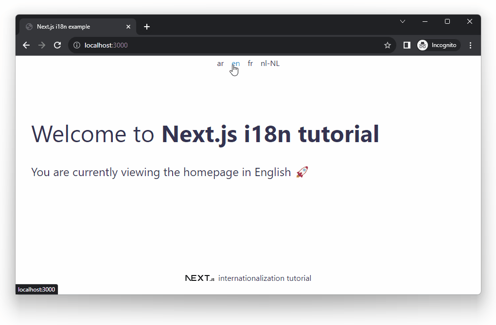

# Next.js internationalization with react-intl example

This project is a tutorial on how to do internationalization (i18n) in Next.js projects with built-in support for internationalized routing and `react-intl` library.

It contains examples for:

- The internationalized routing config
- Automatic Locale Detection
- Setting the `react-intl` library
- Language switcher
- Setting text direction (`ltr`, `rtl`)
- Declarative usage of the `react-intl` library
- Imperative usage of the `react-intl` library

For more details, please see the full post: [Next.js i18n tutorial](https://localizely.com/blog/nextjs-i18n-tutorial/)

## Requirements

- Node
- npm
- git

## Steps to get the app running

- `git clone`
- `cd nextjs-app-router-i18n-example`
- `npm install`
- `npm run dev`
